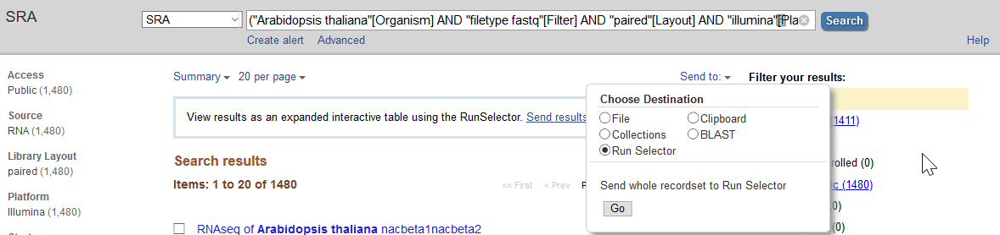

# Gene prediction and optimization using BIND and MIND workflows:

## Overview

Gene models derived from direct inference evidence-based predictions are used for MIND and BIND. 
For MIND, gene preditions by MAKER gene predictions are combined with evidence-base models. 
For BIND, gene preditions by BRAKER are combined with evidence-based models.

1. Finding Orphan Enriched RNAseq dataset form NCBI:
	- Search RNAseq datasets for your organism on NCBI, filter Runs (SRR) for Illumina, paired-end, HiSeq 2500 or newer.
	- Download Runs from NCBI (SRA-toolkit)
	- run quantification against current gene models using kallisto
	- run phylostratR on current gene models to identify orphans
	- Rank the SRRs with highest number of expressed orphans and select feasible amounts of data to work with.

2. Run BRAKER
	- Align RNA-Seq with splice aware aligner (STAR or HiSat2 preferred, HiSat2 used here)
	- Generate BAM file for each SRA-SRR id, merge them to generate a single sorted BAM file
	- Run BRAKER

2. Run MAKER

	- Align RNA-Seq with splice aware aligner (STAR or HiSat2 preferred, HiSat2 used here)
	- Generate BAM file for each SRA-SRR id, merge them to generate a single sorted BAM file
	- Run Trinity to generate transcriptome assembly using the BAM file
	- Run TransDecoder on Trinity transcripts to predict ORFs and translate them to protein
	- Download SwissProt curated Viridaplantae proteins
	- Run MAKER with transcripts (Trinity), proteins (TransDecoder and SwissProt), with homology only mode
	- Use the MAKER predictions to train: SNAP and AUGUSTUS. Self-train GeneMark
	- Run second round of MAKER with above three ab initio predictions along with the previous round MAKER results.

3. Run evidence based predictions:

	- Align RNA-Seq with splice aware aligner (STAR or HiSat2 preferred, HiSat2 used here)
	- Generate BAM file for each SRA-SRR id, merge them to generate a single sorted BAM file
	- Use the sorted BAM files with multiple transcript assemblers for genome guided transcript assembly:
		* Trinity GG
		* Class2
		* StringTie
		* Cufflinks
	- Align Trinity transcripts to the genome to generate GFF3 file (using GMAP)
	- Run PortCullis to remove invalid splice junctions
	- Consolidate transcripts and generate a non-redundant set of transcripts using Mikado.
	- Predict ORFs on these consolidated transcripts using TransDecoder
	- run BLASTx for consolidated transcripts against SwissProt curated dataset.
	- Pick best transcripts using all the above information with Miakdo Pick.

4. BIND
	- Combine BRAKER generated predictions with Evidence predictions using EVM.

5. MIND
	- Combine MAKER generated predictions with Evidence predictions using EVM.


## Steps in detail

### 1. Finding Orphan Enriched RNAseq dataset form NCBI:

Go to [NCBI SRA](https://www.ncbi.nlm.nih.gov/sra) page and search with "SRA Advanced Search Builder". This allows you to build a query and select the Runs that satisfy certain requirements. For example:

```
("Arabidopsis thaliana"[Organism] AND
  "filetype fastq"[Filter] AND
	"paired"[Layout] AND
	"illumina"[Platform] AND
	"transcriptomic"[Source])
```

Then export the results to "Run Selector" as follows:



Clicking the "Accession List" should allow you to download all the SRR ids in a text file format. We can use this for downloading data with SRA toolkit (use [`runSRAdownload.sh`](scripts/runSRAdownload.sh))

```bash
while read line; do
	runSRAdownload.sh $line;
done<SRR_Acc_List.txt
```
Note: depending on how much data you find, this can take a lot of time as well as resources (disk usage). Use caution and narrow down to only most interesting datasets, if you can. Also, note that the max size of the SRA is set to 100Gb in this script. If you have a SRA greater than 100Gb, please edit the script to allow those files to download.


Download the CDS sequences for your organism, if available. **If you don't have one, you can skip this step and use the subset of SRRs for the predictions**.

```
#CDS
wget https://www.arabidopsis.org/download_files/Genes/Araport11_genome_release/Araport11_blastsets/Araport11_genes.201606.cds.fasta.gz
gunzip Araport11_genes.201606.cds.fasta.gz
kallisto index -i ARAPORT11cds Araport11_genes.201606.cds.fasta
```


For each SRR id, run the Kallisto qualitification ([`runKallisto.sh`](scripts/runKallisto.sh)).

```bash
while read line; do
	runKallisto.sh ARAPORT11cds $line;
done<SRR_Acc_List.txt
```
Once done, the tsv files containing counts and TPM were merged using [`joinr.sh`](scripts/joinr.sh):

```bash
joinr.sh *.tsv >> kallisto_out_tair10.txt
```

For every SRR id, the file contains 3 columns, `effective length`, `estimated counts` and `transcript per million`.

Run Phylostratr to identify orphan genes. For running phylostratR program, you need predicted proteins from your gene-prediction method (input).
Once you have the input, run the [`runPhylostrarRa.sh`](scripts/runPhylostratR.sh). This will download the datasets, but will not run BLAST.
Run Blast using [`runBLASTp.sh`](scripts/runBLASTp.sh) and proceed with formatting the BLAST results using [`format-BLAST-for-phylostratr.sh`](scripts/format-BLAST-for-phylostratr.sh).
After which run the [`runPhylostratRb.sh`](scripts/runPhylostratRb.sh).


Once we have the orphan genes identified, total number of orphan genes expressed in each SRR is counted and SRR's are ranked based on number of orphan genes found (>1TPM). Top 38 SRR's is selected (based on total data size), for use with gene prediction in the next steps.


## Run BRAKER

To simplify handling of files, we will combine all the forward reads to one file and all the reverse reads to another.

```bash
cat *_1.fastq.gz >> forward_reads.fq.gz
cat *_2.fastq.gz >> reverse_reads.fq.gz
```

Run BRAKER using the [`runBRAKER.sh`](scripts/runBRAKER.sh) script

``bash
runBraker.sh forward_reads.fq.gz reverse_reads.fq.gz TAIR10_chr_all.fas
```
