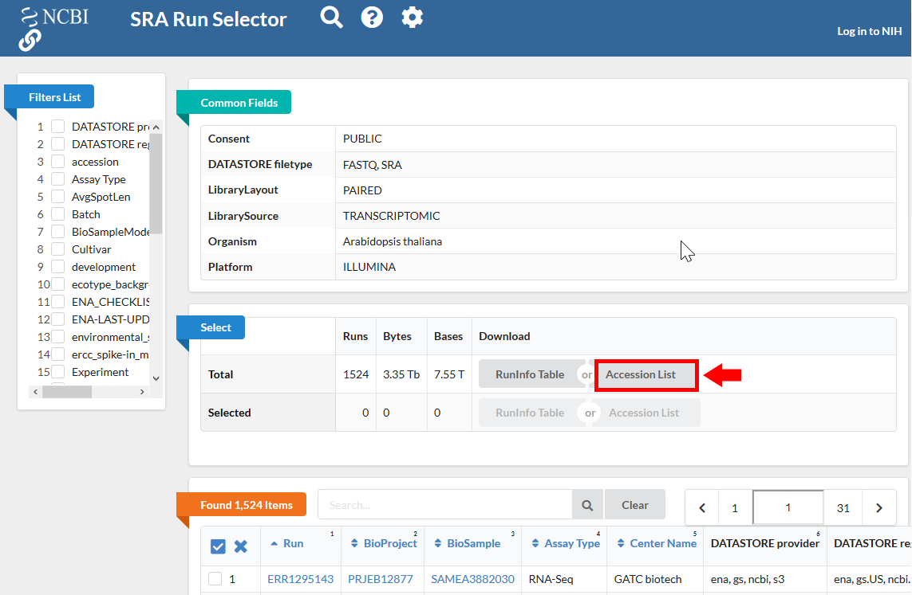

# Find an Orphan-Enriched RNA-Seq dataset from NCBI-SRA:

- Select RNA-Seq SRR ID from NCBI-SRA website for your desired species.

Go to [NCBI SRA](https://www.ncbi.nlm.nih.gov/sra) page and search with "SRA Advanced Search Builder". This allows you to build a query and select the Runs that satisfy certain requirements. For example:

```
("Arabidopsis thaliana"[Organism] AND
  "filetype fastq"[Filter] AND
	"paired"[Layout] AND
	"illumina"[Platform] AND
	"transcriptomic"[Source])
```

Then export the results to "Run Selector" as follows:


Clicking the "Accession List" allows you to download all the SRR IDs in a text file format. 




- Download RNA-Seq raw reads:
```bash
while read line; do
	01_runSRAdownload.sh $line;
done<SRR_Acc_List.txt
```
_Note: depending on how much data you find, this can take a lot of time and resources (disk usage). You may need to narrow down and select only a subset of total datasets. One way to choose datasets with maximal orphan representation is to select SRRs most likely to be diverse (eg: stress response, flowering tissue, or SRRs with very deep coverage)._

- Download the CDS sequences for your organism, and build transcriptome for kallisto index:
```
#CDS
wget https://www.arabidopsis.org/download_files/Genes/Araport11_genome_release/Araport11_blastsets/Araport11_genes.201606.cds.fasta.gz
gunzip Araport11_genes.201606.cds.fasta.gz
kallisto index -i ARAPORT11cds Araport11_genes.201606.cds.fasta
```
- For each SRR ID, run the Kallisto qualitification:
```bash
while read line; do
	02_runKallisto.sh ARAPORT11cds $line;
done<SRR_Acc_List.txt
```

- Merge the tsv files containing counts and TPM:
```bash
03_joinr.sh *.tsv >> kallisto_out_tair10.txt
```
_Note: For every SRR id, the file contains 3 columns, `effective length`, `estimated counts` and `transcript per million`._

- Run phylostratr to infer phylostrata of genes, and identify orphan genes:
  
  1. Build a phylogenic tree for your species, and download proteins sequences for target species:
  ```bash
  ./04_runPhylostratRa.R
  ```
  
  2. Run Blast to compare query proteins and target proteins: 
  ```bash
  while read line; do
  # 3702 is taxid for our focal species A.thaliana.
  # You can replace your own protein sequences for your focal species if protein downloaded from uniprot is not your desired version.
	05_runBLASTp.sh $line 3702.faa;
  done<uniprot_list.txt
  ```
  
  3. Process Blast output and stratify phylostrata level for each query gene:
   ```bash
  ./06_runPhylostratRb.R
  ```
  _Note: Phylostratr will run protein blast automatically if it doesn't detect blast database and output files in working directory, so you can skip step2 to obtain blast output.   However, it may takes a long time depend on the number of species and the size of your query genes. You can also use `strata_diamond` instead of `strata` in `06_runPhylostratRb.R`, it will use Diamond Blast instead of Blast-plus. Diamond blast is much faster than Blast-plus, but may not sensitive as Blast-plus._
 
 - Select Orphan-rich RNA-Seq data
 
   Once the orphan (species-specific) genes are identified, count the total number of orphan genes expressed (>1TPM) in each SRR, rank them based on % orphan expressed. Depending on how much computational resources you have, you can select the top X number of SRRs to use them as evidence for direct inference and as training data.

   _Note: for _Arabidopsis thaliana_, we used all of the SRRs that expressed over 60% of the orphan genes (=38 SSRs)._
   
   
**Note: If you are relying solely on RNA-Seq that you generate yourself, best practice is to maximize representation of all genes by including conditions like reproductive tissues and stresses, in which orphan gene expression is high. You can skip this step if you have your own RNA-Seq dataset.**
 

